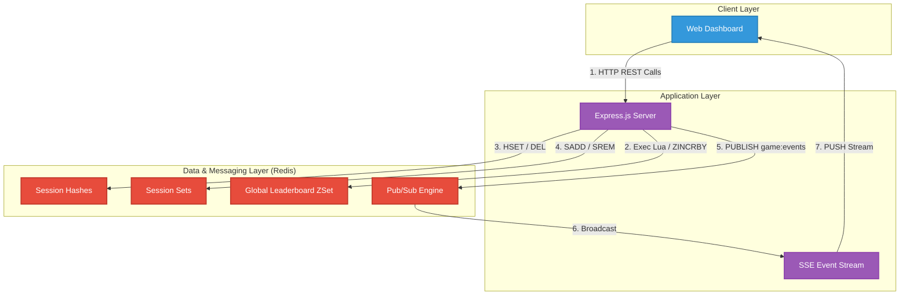
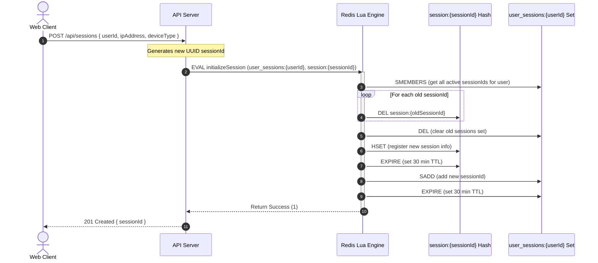
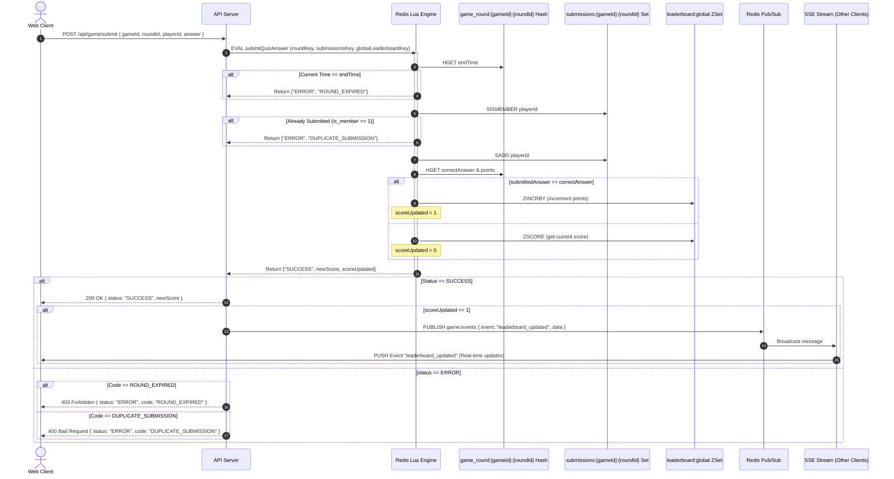

# ⚡ PulseBoard: Redis-Powered Real-Time Game Leaderboard & Session Store

PulseBoard is a high-performance, real-time leaderboard and user session management engine built for competitive quiz platforms. It demonstrates the power of Redis beyond simple caching by leveraging server-side Hashes, Sorted Sets, and Sets, ensuring concurrency safety via pre-cached Lua scripts, and distributing instant updates using a Redis Pub/Sub to Server-Sent Events (SSE) pipeline.

---

## 🏗️ System Architecture & Execution Flows

### 1. Unified System Overview


### 2. Session Creation & Atomic Invalidation Flow
When a user logs in, older sessions must be invalidated atomically using a Lua script to prevent race conditions.



### 3. Atomic Quiz Answer Submission & Propagation Flow
Handles checking round state, enforcing duplicate prevention, updating scores, and pushing live events.



---

## 🛠️ Technology Stack

*   **Runtime**: [Node.js (v20-alpine)](https://nodejs.org/)
*   **Web Framework**: [Express.js](https://expressjs.com/)
*   **Database**: [Redis 7 (alpine)](https://redis.io/)
*   **Redis Client**: [ioredis](https://github.com/redis/ioredis)
*   **Containerization**: [Docker](https://www.docker.com/) & [Docker Compose](https://docs.docker.com/compose/)
*   **Frontend**: Vanilla HTML5, CSS3 (Glassmorphism, custom micro-animations), and Vanilla JavaScript (using `EventSource` for SSE).

---

## 📁 Code Structure & Organization

```
redis-game-leaderboard/
│
├── .env                  # Running configuration variables (ignored by git)
├── .env.example          # Template documenting environment variables
├── Dockerfile            # Multi-stage Docker setup for api service
├── docker-compose.yml    # Main orchestration stack (api + redis services)
├── package.json          # Dependencies & npm scripts
├── server.js             # Core Express server & Redis Lua loading logic
│
├── public/               # Client-side web dashboard code
│   ├── index.html        # Glassmorphic single page dashboard
│   ├── css/
│   │   └── style.css     # Dark mode CSS with glowing highlights & transitions
│   └── js/
│       └── app.js        # SSE listeners, DOM updates, & API controllers
│
├── scripts/
│   └── seed_memory_test.js  # Seeding tool & memory analysis benchmark runner
│
├── MEMORY_ANALYSIS.md    # Findings on listpack vs skiplist encoding
├── README.md             # This highly attractive system overview
├── architecture.md       # High-level architecture documentation
├── projectdocumentation.md  # Detailed system objective and specs
└── submission.json       # Config file containing evaluator test credentials
```

---

## 🚀 Setup & Installation Steps

Follow these steps to run the application locally from scratch:

### 1. Clone & Configure
Clone this project to your local directory.
Copy the environment variables template:
```bash
cp .env.example .env
```
Ensure the default variables in `.env` are set:
```env
REDIS_URL=redis://redis:6379
API_PORT=3000
```

### 2. Run with Docker Compose
Ensure Docker Desktop is open and active, then run:
```bash
docker-compose up -d --build
```
This builds the application image, downloads Redis alpine, configures mutual health checks, and starts the services.

Verify that both containers are healthy:
```bash
docker ps
```
The status should display `Up X seconds (healthy)`.

---

## 💻 Local Execution & Usage Instructions

### 1. Access the Dashboard
Once the containers are running, navigate to:
```
http://localhost:3000
```
This loads the single-page application. The status indicator at the top right will glow green and read `Live Stream Connected` when the SSE pipeline is active.

### 2. Interactive Seeding & Playing
You can test the entire system flow using the widgets on the dashboard:
*   **Seed Game Round**: Click `Active (60s)` to create a round (`r-3`) that is open for submissions, or click `Expired` to create one that is closed.
*   **Quiz Console**: Submit answers for players (e.g. Player `player-1` submits `A`). Correct answers will immediately trigger a score increase on the board.
*   **Live Updates**: Watch the dashboard. When a score updates, an SSE event is caught, adding a message to the scrolling **Live Feed ticker** at the top, and highlighting the updated row in the leaderboard with a green pulse animation.
*   **Player Performance Finder**: Search for a player ID to view their rank, score, calculated percentile standing, and a list of rivals directly above and below them.
*   **Admin Session Manager**: Register a session (which invalidates old sessions for that user) and view/delete sessions live in Redis.

---

## 📊 Run Benchmarking & Memory Tests
To replicate the listpack/skiplist memory analysis and seed 100k test records into your local Redis database:
```bash
docker exec game_api node scripts/seed_memory_test.js
```
The results and explanation can be viewed in [MEMORY_ANALYSIS.md](MEMORY_ANALYSIS.md).
