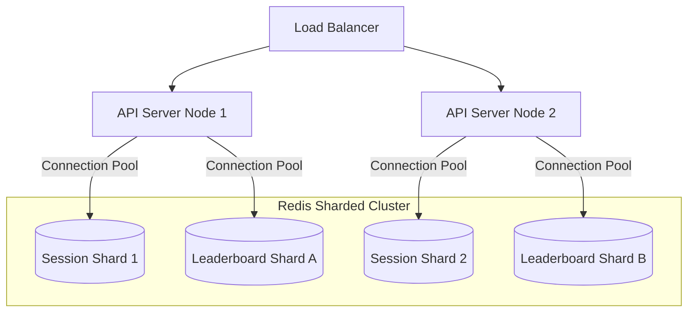

# PulseBoard Questionnaire Answers

This document contains responses to the architectural and design questions regarding the Redis Game Leaderboard and Session Store implementation.

---

## 1. Atomic Answer Submission: Lua Script vs. MULTI/EXEC

### Why a Lua Script is Necessary
A `MULTI/EXEC` transaction block in Redis is a queueing mechanism. Commands inside the block are queued and executed sequentially without interruption, but **Redis cannot perform conditional logic or read-after-write operations within the transaction**. In our answer submission flow, we must check conditions (is the round active? has the player already submitted?) before performing writes (recording the submission, updating scores). 

With `MULTI/EXEC`, we cannot query the state and conditionally branch inside the transaction block based on the result. If we retrieve the values first, make a decision in our application code, and then run `MULTI/EXEC`, we introduce a race condition because another command can execute between our read and write steps.

### Specific Race Condition under MULTI/EXEC
Consider two HTTP requests representing the same player (`player-alpha`) submitting answers to the same round (`r-3`) in parallel:
1.  **Request A** checks membership of `player-alpha` in the submissions Set (`submissions:g-501:r-3`) -> Redis returns `0` (not submitted).
2.  **Request B** checks membership of `player-alpha` in the same Set -> Redis returns `0` (not submitted).
3.  **Request A** opens a `MULTI` transaction, queues `SADD` and `ZINCRBY`, and runs `EXEC`. It succeeds, awarding points.
4.  **Request B** opens a `MULTI` transaction, queues `SADD` and `ZINCRBY`, and runs `EXEC`. It also succeeds, awarding points again.

The player is successfully awarded points twice for the same round. 

Using `WATCH` (Optimistic Locking) to monitor the submissions key could prevent this by aborting the transaction for Request B. However, under high concurrency, this causes a high volume of transaction failures, requiring clients to retry repeatedly, which wastes CPU and network resources.

### The Check-Then-Act Problem and Lua's Solution
The "check-then-act" pattern is a classic concurrency issue where an application reads a database state, decides on an action, and commits the action. If the database state changes between the check and the act, the decision becomes invalid.

Lua scripts solve this by running **atomically and synchronously within Redis's single-threaded command processor**. While the Lua script executes, no other command from any client can run. This ensures that the state checked in the script remains completely unchanged when the writes are committed, eliminating command interleaving and race conditions.

---

## 2. Redis Key Schema Design

We structured the keys using the standard `object-type:id:field` convention to maintain namespace isolation and prevent collisions.

| Data Type | Key Pattern | Description | Rationale |
| :--- | :--- | :--- | :--- |
| **Hash** | `session:{sessionId}` | Individual session data object (`userId`, `ipAddress`, `deviceType`, `createdAt`, `lastActive`). | Hashes organize object fields efficiently, allowing `HGET`/`HSET` of individual fields without reading/writing serialized JSON strings. |
| **Set** | `user_sessions:{userId}` | Set of active session IDs for a specific user ID. | Acts as a secondary index. Provides O(1) lookup to find and invalidate all of a user's active sessions without executing costly scanning commands. |
| **Sorted Set** | `leaderboard:global` | The global score table containing player IDs and numeric scores. | Maintains a sorted list of players dynamically. Score updates (`ZINCRBY`) and rank lookups (`ZREVRANK`) are executed at O(log(N)) complexity. |
| **Hash** | `game_round:{gameId}:{roundId}` | Round metadata storing `correctAnswer`, `points`, and `endTime`. | Isolates metadata configurations per round instance. |
| **Set** | `submissions:{gameId}:{roundId}` | Set of player IDs who submitted answers for this round. | Provides O(1) lookup (`SISMEMBER`) to verify if a player has already submitted an answer. |

---

## 3. Scaling to Millions of Concurrent Players

If the application scaled to millions of concurrent users, the following bottlenecks would emerge, along with their respective architectural evolutions:

### Primary Bottlenecks
1.  **Single-Threaded CPU Bottleneck on Global Leaderboard**: A single Sorted Set (`leaderboard:global`) under millions of writes/sec will bottleneck the single Redis thread.
2.  **Network Bandwidth on SSE Streams**: Streaming real-time updates to millions of active dashboards creates a network interface card (NIC) bottleneck on the API servers.
3.  **Connection Limits**: Managing millions of concurrent TCP connections from API servers to Redis.

### Architectural Evolutions

1.  **Redis Sharding and Clustering**:
    *   **Sessions**: Distribute session hashes and user indexes across a sharded Redis Cluster. Since keys contain `{userId}` or `{sessionId}`, standard hash slots will partition them evenly.
    *   **Leaderboards**: Shard the leaderboard by game instance (e.g. `leaderboard:game:{gameId}`) or by region. If a global leaderboard is required, we can shard players into score-based buckets, query the top N from each bucket, and merge them at the API layer (scatter-gather pattern), or maintain a highly optimized, smaller "Top 100" global leaderboard that is updated asynchronously.
2.  **Connection Pooling**:
    *   Implement connection pools at the API level (e.g., using `ioredis` pooling configurations) with keep-alive connections to reuse sockets and avoid the overhead of continuous TCP handshakes.
3.  **Horizontal API Server Scaling**:
    *   Deploy a stateless fleet of Express API instances behind a Load Balancer (Nginx/ALB).
    *   Scale the SSE connections horizontally. When a player score updates, the event is published to Redis Pub/Sub. All running API instances receive the message and push it to their locally connected dashboard clients.

---

## 4. Structured Error Protocol in Lua

We designed a structured array protocol for the Lua script's return values:

*   **Success Format**: `{"SUCCESS", "<newScore>", "<scoreUpdated>"}` (e.g., `{"SUCCESS", "1500", "1"}`)
*   **Error Format**: `{"ERROR", "<error_code>"}` (e.g., `{"ERROR", "DUPLICATE_SUBMISSION"}`)

### Rationale and Benefits
*   **Contextual Error Handling**: A simple boolean (`true`/`false`) only indicates whether the operation succeeded or failed. It cannot communicate the *reason* for the failure. The client-side application must distinguish between a `ROUND_EXPIRED` (403 Forbidden) and a `DUPLICATE_SUBMISSION` (400 Bad Request) to display the correct message to the player.
*   **Single Round-Trip Execution**: On success, the script returns both the new score and whether the score was updated (`scoreUpdated`). This allows the API to decide whether to trigger a Pub/Sub broadcast without performing an additional `ZSCORE` or database read, reducing network round-trips.

---

## 5. Session Invalidation Trade-Offs: Lua Script vs. Client-Side Pings

For session management, we implemented an atomic Lua script that invalidates older sessions upon a new login. The trade-offs of this approach compared to client-side keep-alive pings are:

| Metric | Lua Script Invalidation (Our Approach) | Client-Side Keep-Alive Pings |
| :--- | :--- | :--- |
| **Atomicity** | **Excellent (100%)**. Old sessions are deleted instantly in the same command execution as the new login. | **Poor**. Old sessions linger until their inactivity timer expires. A user can maintain multiple active sessions during this window. |
| **Network Traffic** | **Very Low**. Network traffic is only generated during login and logout events. | **Very High**. Millions of clients must continuously send pings (e.g., every 30s), creating massive network overhead. |
| **Server Load** | **Minimal**. Redis only executes writes during explicit session state changes. | **Significant**. The server must continuously ingest pings, parse authorization headers, and execute write commands (`HSET lastActive`) for all active users. |
| **User Experience** | **Instant and Secure**. Logging in on a new device instantly logs out the old device, protecting account security. | **Delayed**. Old sessions remain active until the inactivity timeout is reached. |
| **Reliability** | **High**. Does not depend on the client's network state to clean up keys. | **Medium**. Network dropouts can cause active sessions to be prematurely invalidated as expired. |
