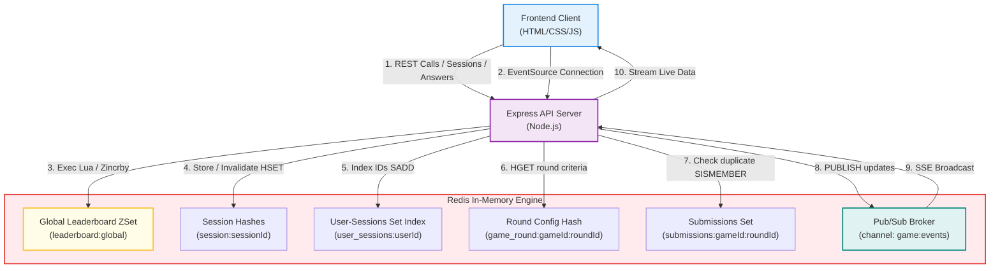
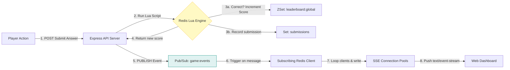

# 🏛️ System Architecture Documentation

This document describes the high-level system architecture, design decisions, database modeling, and execution logic of the PulseBoard Game Leaderboard.

---

## 1. Project Idea & Objective
The core objective is to design a high-throughput, low-latency, real-time gaming backend capable of:
*   Maintaining a concurrent session store that automatically limits users to a single active login.
*   Enforcing cheat-resistant round submissions where rules (expiration, single-answers) are checked without race conditions.
*   Updating a live global leaderboard instantly with extremely fast `O(log(N))` operations.
*   Distributing real-time state changes to all connected client dashboards using minimal resources.

---

## 2. High-Level System Architecture
The application uses a decoupled multi-tier architecture composed of:
1.  **Presentation Tier**: Static single-page dashboard (HTML5, Vanilla CSS, JS).
2.  **Application Tier**: Node.js API server running Express.js.
3.  **Data Tier**: Redis 7.0 server acting as the in-memory state engine, database, and messaging broker.

---

## 3. Data Flow & Execution Flow

### Data Flow for Score Update Event

---

## 4. Key Modules & Responsibilities

### A. API Web Server (`server.js`)
*   **Routing**: Exposes REST interfaces for player interaction (sessions, leaderboard retrieval, answers) and SSE streams.
*   **Redis Command Client**: Initializes connection pools, loads Lua scripts, and runs pipeline commands for high throughput.
*   **SSE Client Pool**: Manages connected browser client responses, writing data frames when Pub/Sub events arrive.

### B. Redis Lua Scripting Module
*   **Session Invalidation Script (`initializeSession`)**: Clears old user session hashes, deletes set indexes, registers new details, and applies TTL.
*   **Quiz Submission Script (`submitQuizAnswer`)**: Verifies round validity, registers answers, check duplicates, and writes updates.

### C. Live Dashboard Client (`public/js/app.js`)
*   **Connection Controller**: Initializes and auto-recovers Server-Sent Events (`EventSource`).
*   **Leaderboard Renderer**: Fetches standings, sorts them, and flashes updated scores.
*   **Admin Panel**: Controls session registration, active user querying, and manually triggering session invalidation.

---

## 5. Technology Selection Rationale

*   **Redis**: In-memory speeds are crucial for competitive leaderboards. Relational databases require complex indexing and sorting operations `O(N*log(N))` on disk, which bottlenecks under write-heavy loads. Redis ZSets keep elements sorted at `O(log(N))` complexity directly in memory.
*   **Lua Scripting**: Allows executing multi-stage logic (check-then-set) directly on the Redis server in a single thread, avoiding network latency between statements and eliminating race conditions.
*   **Server-Sent Events (SSE)**: For one-way data broadcasts (leaderboard updates), SSE is lighter, less complex, and consumes fewer resources than WebSockets. It runs over standard HTTP, natively supporting auto-reconnection.
*   **Node.js**: The single-threaded event loop of Node.js is perfect for handling thousands of concurrent, long-lived SSE connections with minimal memory overhead.

---

## 6. Advantages, Benefits, Pros & Cons

### Pros
*   **Extreme Performance**: All read and write operations are performed in memory (sub-millisecond latency).
*   **Concurrency Safe**: Lua scripting ensures database transactions are fully ACID at the command level without expensive row locks.
*   **Compact Storage**: Lowers memory overhead by utilizing `listpack` encoding for small sorted sets and session hashes.
*   **Real-time Broadcast**: Pub/Sub instantly notifies multiple running API instances without database polling.

### Cons
*   **Memory Bound**: Redis keeps all data in RAM. A massive player base (10M+ active sessions) requires high RAM capacity (though mitigated by compact listpack encodings).
*   **One-Way Messaging**: SSE only supports server-to-client communication. Upstream actions (player submissions) still require standard HTTP REST requests.
