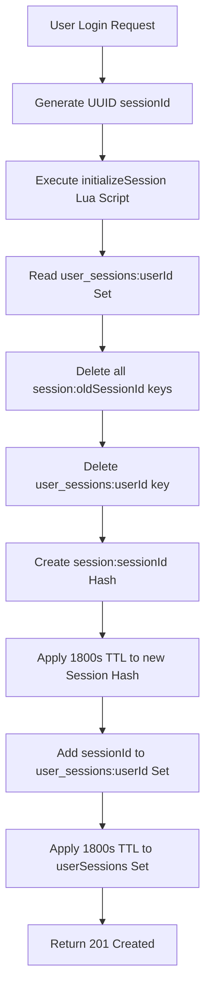
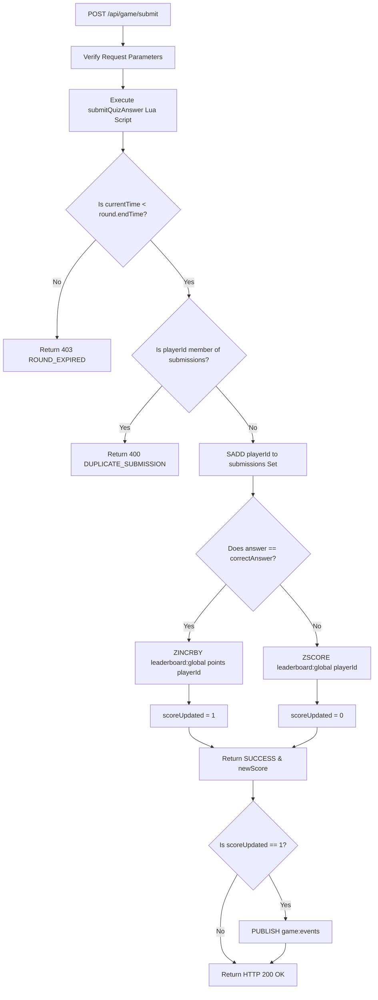

# 📝 Project Documentation

This documentation provides a comprehensive guide to the PulseBoard Game Leaderboard & Session Store, covering core requirements, technical implementation details, problem-solving strategies, and testing strategies.

---

## 1. Project Objective
In gaming, real-time analytics, and high-frequency bidding, systems must process thousands of writes per second while keeping stats (like player rankings) sorted and instantly visible. PulseBoard addresses these challenges by:
*   Implementing **atomic user session state management** with a sliding expiration.
*   Enforcing **concurrency-safe game round answer submissions**.
*   Providing **real-time visual updates** of player standings using low-overhead Server-Sent Events (SSE).

---

## 2. Problem-Solving Approach & Concurrency Strategy

### The Race Condition Challenge
In multi-client applications, classic race conditions occur when executing a "check-then-act" sequence:
1.  **Check**: Read if a user has an active session or has already submitted an answer.
2.  **Act**: If valid, save the session or award points.

If two requests arrive at the same time:
*   Both processes check and see the session doesn't exist yet.
*   Both register new sessions, violating the single-active-session policy.
*   In quiz games, a player clicking "Submit" twice rapidly could receive double points.

### The Solution: Redis-Cached Lua Execution
To eliminate this vulnerability without introducing heavy, distributed locking overhead, we push the entire validation and write logic into a Lua script on the Redis server:
*   **Indivisible Execution**: Redis runs the script in a single, block-exclusive thread. No other commands can run midway.
*   **Cached Scripts**: Express loads scripts using `redis.defineCommand()`, which registers the script's SHA1 hash. Redis executes the cached script at native C speeds.

---

## 3. Crucial Components & Integration Details

### A. Session Store (`session:{sessionId}` & `user_sessions:{userId}`)
*   **Session Creation**: The script clears all old session hashes mapped in the user's sessions index Set (`user_sessions:{userId}`), deletes the index itself, registers the new session Hash with a 30-minute TTL, and indexes the new session.
*   **Sliding Expiration**: When checking or listing sessions, the TTL is reset.

### B. Game Round Submissions (`game_round:{gameId}:{roundId}` & `submissions:{gameId}:{roundId}`)
*   **Round Metadata**: Stores `correctAnswer`, `points`, and `endTime` (Unix timestamp in seconds).
*   **Duplicate Guard**: The Set `submissions:{gameId}:{roundId}` keeps track of player IDs who have answered. A fast `SISMEMBER` check prevents duplicate point rewards.

### C. Pub/Sub to SSE Pipeline
*   **Pub/Sub**: We use a dedicated subscriber client `subRedis` that subscribes to the channel `game:events`.
*   **Event Broker**: When score updates occur, the main Redis client publishes the event payload. `subRedis` handles the event and loops through the active pool of HTTP SSE responses (`sseClients`), writing standard SSE chunked frames:
    ```
    event: leaderboard_updated
    data: {"playerId":"player-alpha","newScore":75}
    
    ```

---

## 4. System Workflows

### User Login / Session Management


### Quiz Answer Submission


---

## 5. Verification & Testing Strategy

To guarantee the reliability, performance, and accuracy of PulseBoard, the following test plan is executed:

### A. Automated Integration Testing
Wrote verification routines validating all core functionality:
1.  **Session Invalidation Test**: Creates multiple sessions for a test user and asserts that only the latest session remains in the `user_sessions` index and the old keys are deleted.
2.  **Duplicate Submission Guard**: Sends multiple answer submissions for the same user and round; asserts that the first request succeeds (200 OK) while subsequent requests are rejected (400 Bad Request with code `DUPLICATE_SUBMISSION`).
3.  **Round Expiration Guard**: Seeds a round with an `endTime` in the past and asserts that answer submissions return a 403 Forbidden with code `ROUND_EXPIRED`.
4.  **Real-Time SSE Event Broadcasting**: Establishes an SSE stream, fires a score update, and asserts that the `leaderboard_updated` payload is successfully pushed to the client within 2 seconds.

### B. Scalability & Memory Benchmark
Conducted benchmarking tests (available in [MEMORY_ANALYSIS.md](MEMORY_ANALYSIS.md)):
*   Populated a global leaderboard with **100,000 active players** to verify O(log(N)) scale responsiveness.
*   Compared **listpack** memory optimization vs **skiplist** encoding, showing a **+441.10%** memory growth when forcing skiplist encoding. This validates the use of listpacks for space-efficient Redis configurations.
